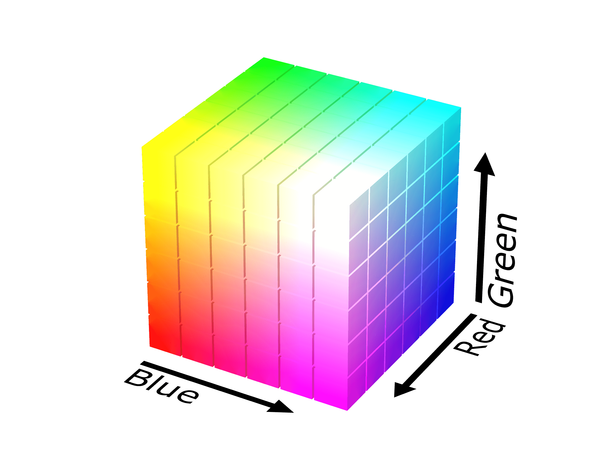

# Identificação de linhas de plantio em imagens aéreas de lavouras
Iuri Rezende Souza

Orientador: Prof. Dr. Mauricio Cunha Escarpinati

---

##Fundamentação Teórica

- Agricultura de Precisão
- VANTs
- Binarização de Imagens
- Transformada de Distância
- Operações morfológicas
- Espaço de cores

+++

### Agricultura de Precisão

- Divisão granulada do talhão
- Georreferenciamento
- Aplicação a taxa variável
- NDVI
- VANTs

+++

### VANTs

+++

### VANTs

- Sensores
- Atuadores
- Controladora

+++

### Binarização de Imagens

+++

### Binarização de Imagens

- Preto: $$v = 0$$
- Branco: $$v = 1$$ |
- Escala de cinza: $$ 0 < v < 1$$ |

+++

### Transformada de Distância

+++

### Operações Morfológicas
#### Erosão

+++

### Operações Morfológicas
#### Dilatação

+++

### Operações Morfológicas
#### Abertura & Fechamento

+++

### Espaço de Cores

RGB

+++

### Espaço de Cores

HSV

---

##Trabalhos Correlatos

---

## 3 Etapas do Algoritmo:

1. Localização de Plantas
2. Busca de Linhas Gerais
3. Melhorar Linhas Encontradas

---

##Localização de Plantas

---

##Busca de Linhas Gerais

+++

<canvas data-chart="radar">
Direção, 0, 1, 2, 3, 4, 5, 6, 7, 8
Contagem, 1, 1, 1, 1, 1, 18, 1, 1, 0
</canvas>

---

##Melhorar Linhas Encontradas

---

##Resultados e Discussões

---

##Conclusão e Trabalhos Futuros
